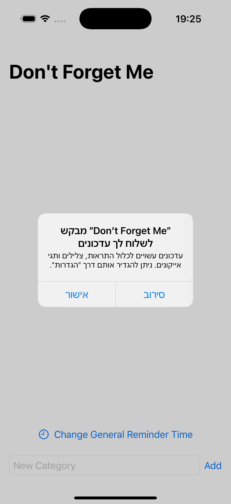
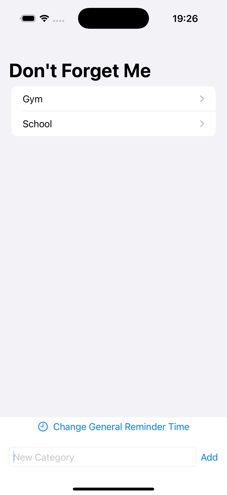
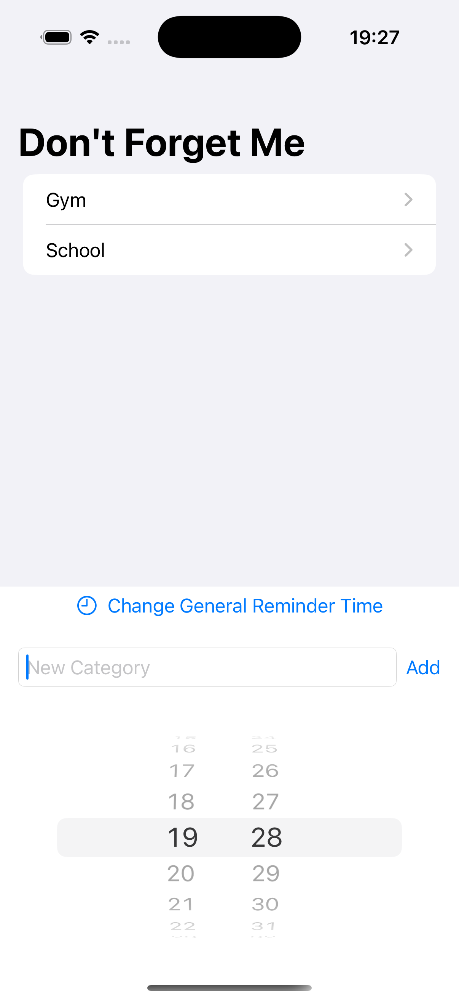
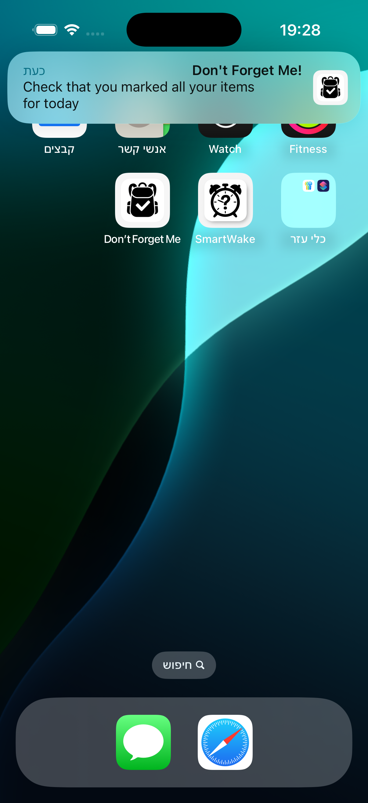
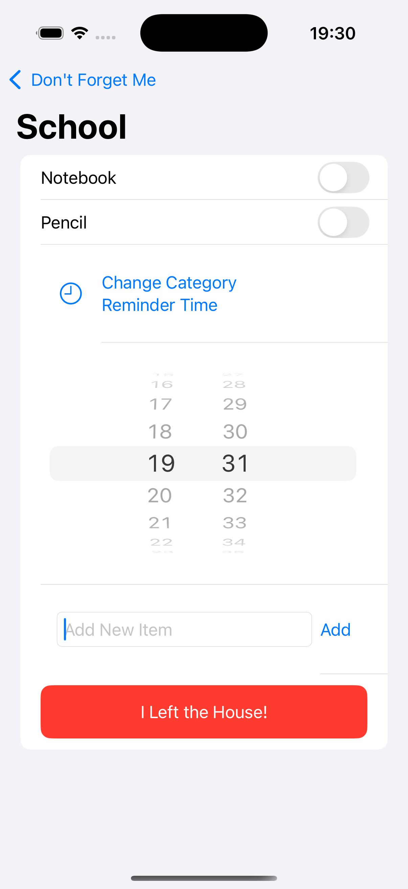
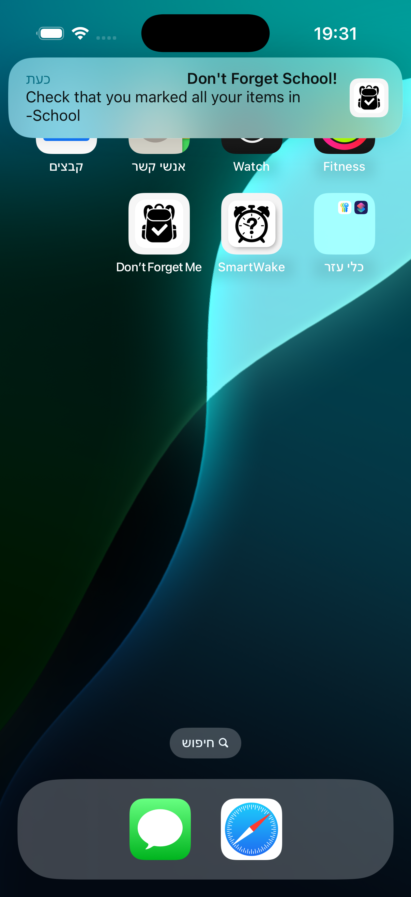
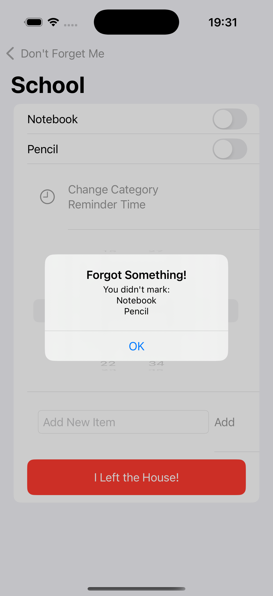
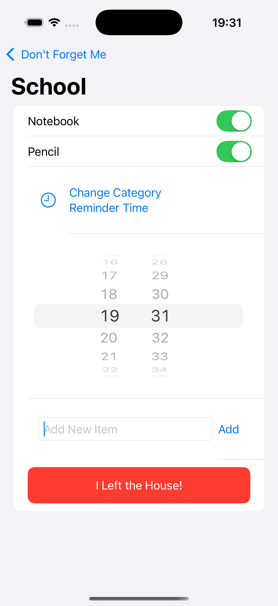

# Don’t Forget Me – Smart Checklist Reminder App

Don’t Forget Me is an iOS checklist‑reminder app that helps you remember everything you need before you head out the door. Create categories , add items, set daily reminders—and get a gentle nudge if you try to leave with unchecked tasks.

---

## 🚀 Overview

The app combines persistent checklists with **local notifications**. A global reminder can be set once for all lists, and each category can optionally have its own daily alert. A single tap on **"I Left the House!"** warns you about anything still unchecked.

---

## 🛠 Tech Stack

* **Language:** Swift
* **Framework:** SwiftUI
* **Data Storage:** `UserDefaults` (JSON‑encoded)
* **State Management:** `@StateObject`, `@ObservedObject`, `@AppStorage`
* **Notifications:** `UserNotifications` (local, repeating)

---

## 🎯 Features

* 📂 **Categories & Items** – Organise your life with multiple checklists.
* ✏️ **Quick Add** – Add categories and items.
* ⏰ **Global Daily Reminder** – One time that triggers a generic “Don’t Forget Me!” notification.
* 🕑 **Per‑Category Reminder** – Override the global time for any list that needs a different hour.
* ✅ **Persistent Toggles** – Item states are stored locally and restored on app launch.
* 🚨 **Leaving‑Home Check** – Tap **"I Left the House!"** to see an alert of unchecked items before you go.

---

## 🧪 How It Works

1. **Create a Category** – Type a name (e.g., “School”) and tap **Add**.
2. **Add Items** – Inside a category, enter items such as “Notebook”, “Pencil”.
3. **Set Global Reminder** – In the main view choose a time; the app schedules a repeating `UNCalendarNotificationTrigger`.
4. **Optional Per‑Category Time** – Inside any list, pick a custom hour & minute.
5. **Receive Alerts** – At the scheduled times you’ll see a notification with sound.
6. **Check Items Off** – Use toggles to mark items done; state is saved automatically.
7. **Leaving‑Home Safety Net** – Tap the red button; if anything is still unchecked, an alert lists what you forgot.

---

## 📲 Installation

1. Open the project in Xcode.
2. Run the app
3. Grant notification permission when prompted.

---

## 📸 Screenshots

### 📩 Notification Permission Request

### 🗂 Category List 

### ⏰ Time Picker General

### 🔔 Reminder Notification General

### ⏰ Time Picker Catagory

### 🔔 Reminder Notification Catagory

### 🚨 Leaving Home Alert

### 🚨 Leaving Home Alert OK

---

## 🔒 Permissions

* **Notifications:** Required for daily reminders.

---

## 🙌 Author

Developed by Leroy Fainberg as part of learning Swift and SwiftUI.
